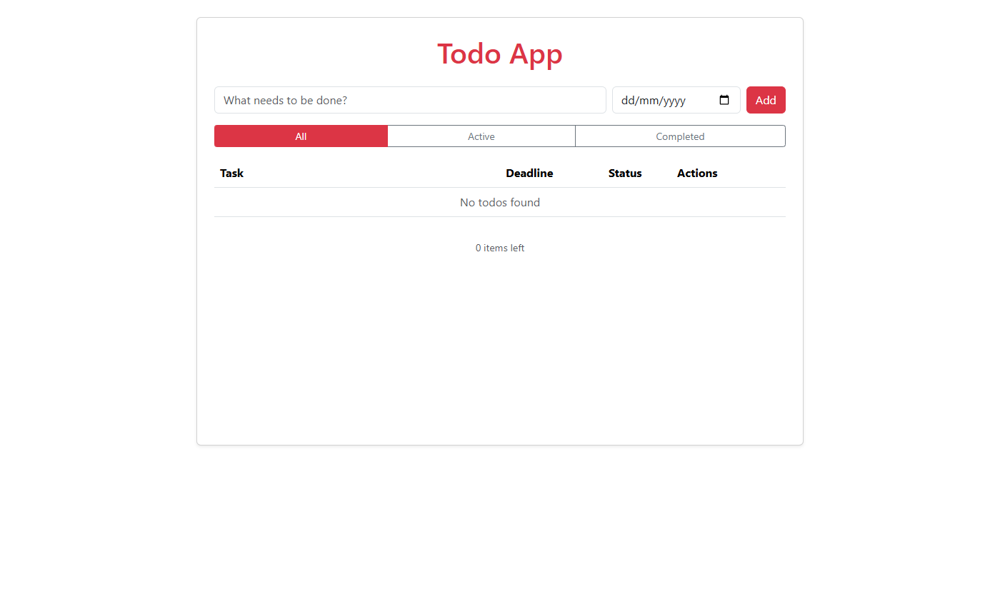
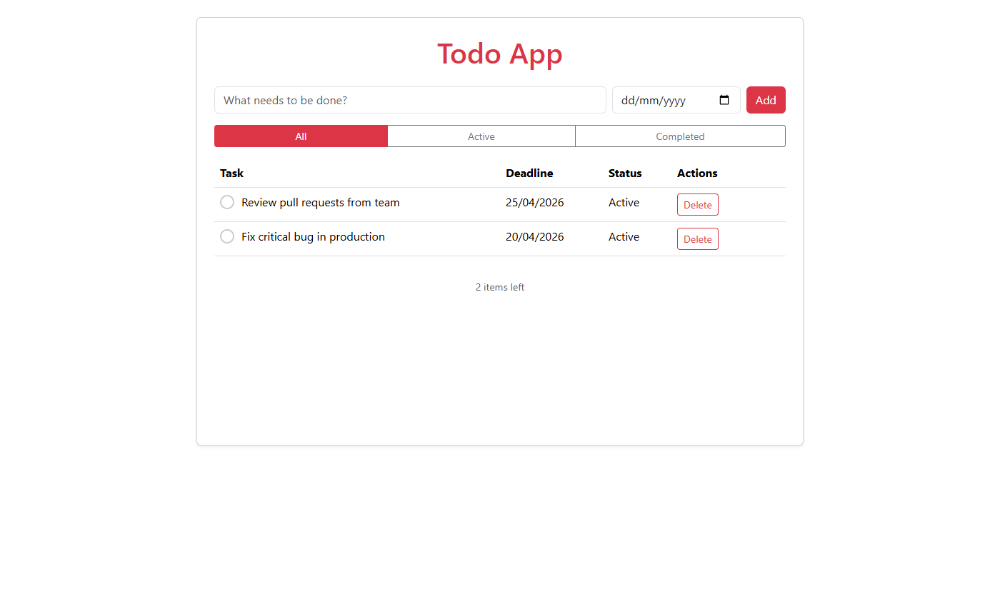
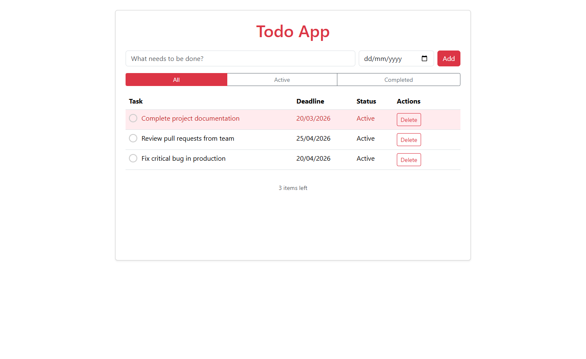
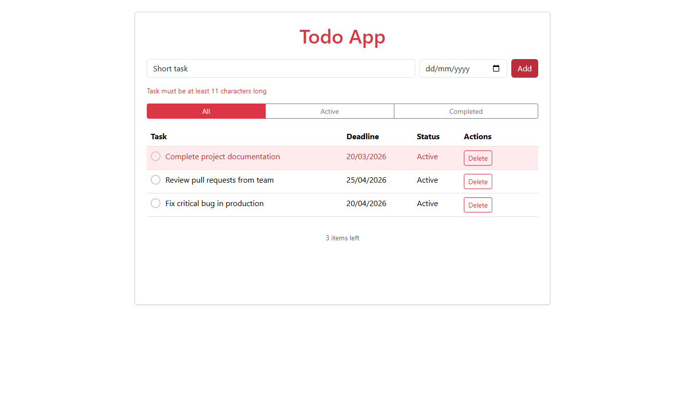
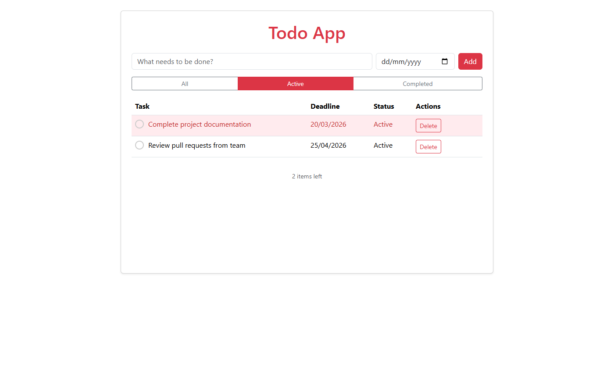
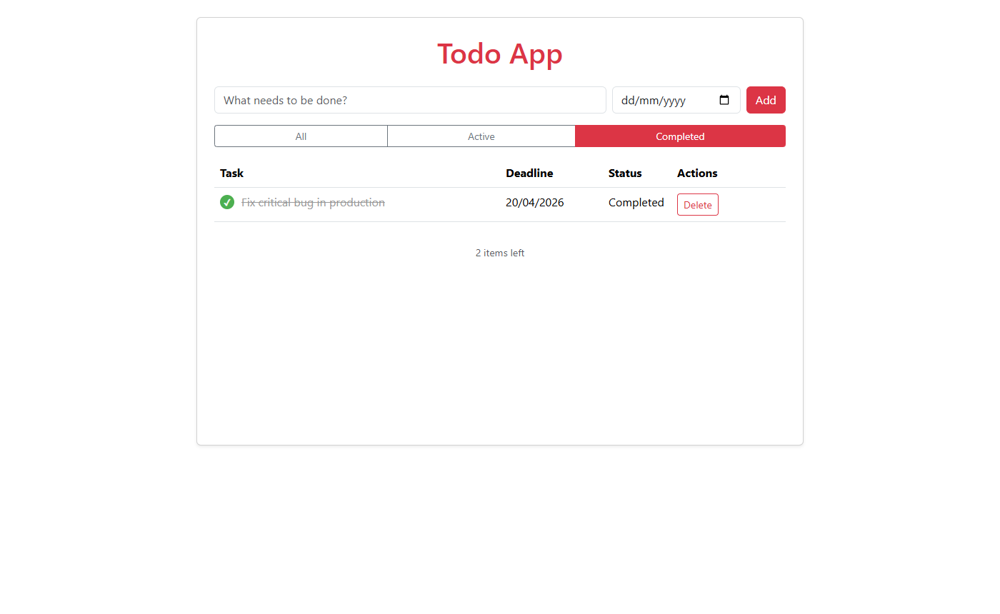

# Todo App

A full-stack Todo application with a **React + TypeScript** frontend and **C# ASP.NET Core** backend, using **EF Core In-Memory Database** for storage. 

## Tech Stack

| Layer    | Technology                                    |
|----------|-----------------------------------------------|
| Frontend | React 19, TypeScript, Vite, Bootstrap 5 (CDN) |
| Backend  | ASP.NET Core (.NET 10), Entity Framework Core |
| Database | EF Core In-Memory                             |
| Mapping  | AutoMapper                                    |
| Docker   | Docker Compose (multi-container)              |

## Project Structure

```
TODO Task/
├── docker-compose.yml
├── .gitignore
│
├── backend/
│   ├── Program.cs                  # Entry point — DI, middleware, rate limiting
│   ├── Controllers/
│   │   └── TodosController.cs      # REST API endpoints (thin, delegates to service)
│   ├── Services/
│   │   └── TodoService.cs          # ITodoService interface + implementation (CRUD + mapping)
│   ├── DTOs/
│   │   ├── TodoBaseDto.cs          # Shared base: Title + Deadline with validation
│   │   ├── CreateTodoDto.cs        # Inherits TodoBaseDto (create input)
│   │   ├── UpdateTodoDto.cs        # Inherits TodoBaseDto + IsCompleted (update input)
│   │   └── TodoResponseDto.cs      # API output 
│   ├── Mappings/
│   │   └── MappingProfile.cs       # AutoMapper: Entity → ResponseDto (computes IsOverdue)
│   ├── Data/
│   │   └── AppDbContext.cs          # EF Core database context + TodoEntity definition
│   ├── appsettings.json             # App configuration
│   ├── Dockerfile
│   └── TodoApi.csproj
│
├── frontend/
│   ├── index.html                   # Entry HTML + Bootstrap 5 CDN
│   ├── src/
│   │   ├── App.tsx                  # Root component — state, optimistic updates
│   │   ├── App.css                  # Custom styles only (overdue, checkbox, strikethrough)
│   │   ├── main.tsx                 # React entry point
│   │   ├── components/
│   │   │   ├── TodoForm.tsx         # Add task form + client-side validation
│   │   │   ├── TodoFilters.tsx      # All / Active / Completed filter buttons
│   │   │   └── TodoTable.tsx        # Table with checkbox toggle, overdue highlight
│   │   ├── services/
│   │   │   └── todoApi.ts           # fetch wrapper for backend REST API
│   │   └── types/
│   │       └── index.ts             # TodoItem interface, Filter type
│   ├── vite.config.ts
│   ├── package.json
│   └── Dockerfile
```

## Getting Started

### Option 1: Docker (Recommended)

**Prerequisites:** [Docker Desktop](https://www.docker.com/products/docker-desktop/) installed and running.

```bash
docker compose up --build
```

- Frontend: http://localhost:3000
- Backend API: http://localhost:5000

> First build takes a few minutes (downloading .NET SDK + Node images).

### Option 2: Run Locally

**Prerequisites:** [.NET 10 SDK](https://dotnet.microsoft.com/download) and [Node.js](https://nodejs.org/) installed.

**Backend** (Terminal 1):
```bash
cd backend
dotnet restore
dotnet run
```

**Frontend** (Terminal 2):
```bash
cd frontend
npm install
npm run dev
```

> Data is stored in-memory and resets when the backend stops. No database installation or connection string needed.

## API Endpoints

| Method | Endpoint            | Body                                  | Response     | Description        |
|--------|---------------------|---------------------------------------|--------------|--------------------|
| GET    | /api/todos          | —                                     | 200 + array  | List all todos     |
| POST   | /api/todos          | `{ title, deadline? }`                | 201 + object | Create a todo      |
| PUT    | /api/todos/{id}     | `{ title, deadline?, isCompleted }`   | 200 + object | Update a todo      |
| DELETE | /api/todos/{id}     | —                                     | 204          | Delete a todo      |


### Validation

- Title is required, minimum 11 characters, maximum 200 characters
- Deadline is optional
- Enforced both client-side (React) and server-side (DTO annotations + sanitization)
- Invalid requests return `400` with `{ "error": "Title must be at least 11 characters long." }`

### Rate Limiting

- GET endpoints: 100 requests/minute per IP
- POST/PUT/DELETE endpoints: 30 requests/minute per IP
- Exceeded limits return `429 Too Many Requests`

## Features

- Add todos with optional deadline date
- Toggle completion via clickable checkbox
- Delete todos
- Filter: All / Active / Completed
- Overdue tasks highlighted in red 
- Completed tasks shown with strikethrough
- Active item count at the bottom
- Responsive design
- In-memory Database

## Screenshots

### Main Screen
Initial Main Screen.



### Adding Tasks
Two tasks added with future deadlines, both showing as Active with 2 items left.



### Overdue Task
A task with a past deadline is highlighted in red across the entire row, making overdue items immediately visible.



### Validation Error
Entering a title shorter than 11 characters displays a client-side validation error in red below the input field.



### Active Filter
The Active filter shows only incomplete tasks, hiding any completed ones.



### Completed Filter
The Completed filter shows only finished tasks, displayed with a strikethrough and a green checkmark.



